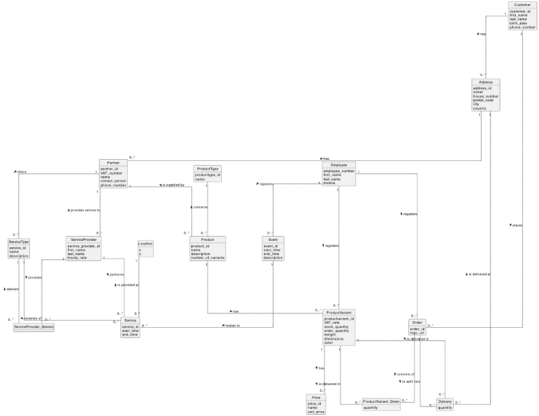

# Assignment Document Generator TODO

In this exercise you will apply the basic software engineering concepts you've learned from the previous exercises, but all together and on a larger scale.
Remember the goal of this course is to teach you the architectural insights and skills required to design large-scale systems that are modular, scalable and evolvable.
To support the learning process, it is beneficial for you to have some hands-on experience with developing a larger system using the basis software engineering concepts of a mirror class, noun classes and verb classes such as a reader and writer).
These will be the building blocks to create the larger system of this exercise.

The exercise is about a fictious company that provides services and sell products that are local to the Antwerp region, called The Antwerp Company (TAC).
The domain model that shows all is included below.

## Required functionality

To create a document generator, you first need to develop the Java files of the domain classes that contain the required data to include in the generated document.
To create an **invoice generator**, you need data from _at least_ these domain classes:

1. Customer (see code example shown in class)
2. Order
3. ProductVariant_Order
4. ProductVariant
5. Price

If you have not yet developed Java classes for these domain classes in previous assignments, you first need to develop these.
You can do this manually, or write code generators to generate the code for these files. 

For each of these domain classes, you need to develop:

- A Java class that contains the **details** of the domain class and links to the associated class(es)
- A Java class to manage a **list** of instances of the domain class, including links to the associated class(es)
- A **reader** Java class to read data about instances of the domain class from a csv file
- A **csv file** containing the data of 10 instances

In addition to this, you need to develop:

- A **mirror class** that reads the data from each domain class from its csv file
- A **document generator** that generates an invoice document for each order in the system, in a Markdown format. An invoice should include all required and relevant information that is available in the system. This includes:
  - Information about the customer
  - Information about the order
  - Information about the products that are part of the order
  - Invoice amount for each order line, and the total invoice amount (both excluding and including VAT)
  - ...

## Learning objectives TODO

- Develop a larger scale system using basic software engineering concepts learned form this course
- Discover that adhering to a well-modularized and scalable software architecture requires repetitive programming in which every class is very similar to the others of its type
- Learn to do your own research when confronted with a technical challenge such as implementing a REST API